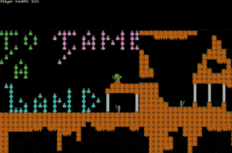
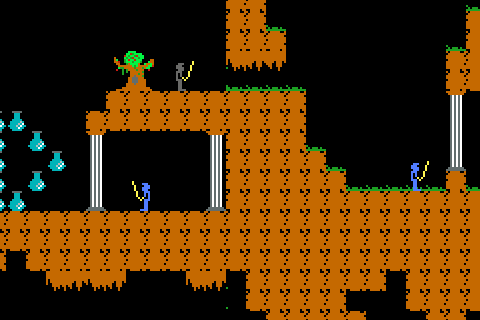

# README


<figcaption>
Animated gif of the game
</figcaption>


<figcaption>
Screen capture
</figcaption>

To Tame A Land is a HTML5 remake originally written on the Apple II in 1992. It uses the ImpactJS game engine. It also uses the impact-node server instead of Impact's built-in PHP solution for the Weltmeister editor and for baking.

# The game


- You are a knight who has to defeat other knights, ghosts, fireballs and eventually a demon in the depths of the caves. The game is not finished.
- Version 0.9.2

# Setup

- Install the impact-node server by typing ```npm install -g impact-node``` and then type ```impact-node serve``` and go to http://localhost:3000
- Does not require ```impact-node``` but is set up for it and is missing some of Impact's tools for building using bake script.
- Dev code changes are seen in localhost:3000. To build, type ```impact-node build```</li>
</ul>

# Author

- Justin Stahlman
- @stahlmandesign on github
- @jstahlman on bitbucket
